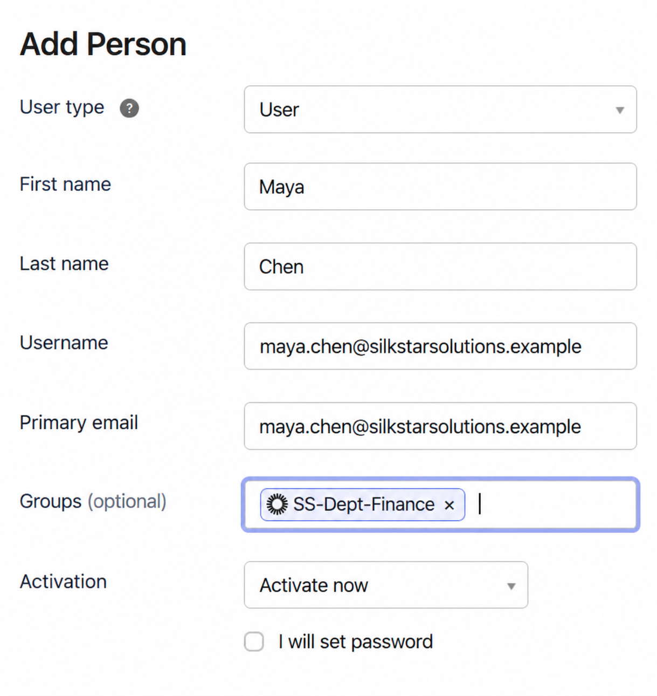
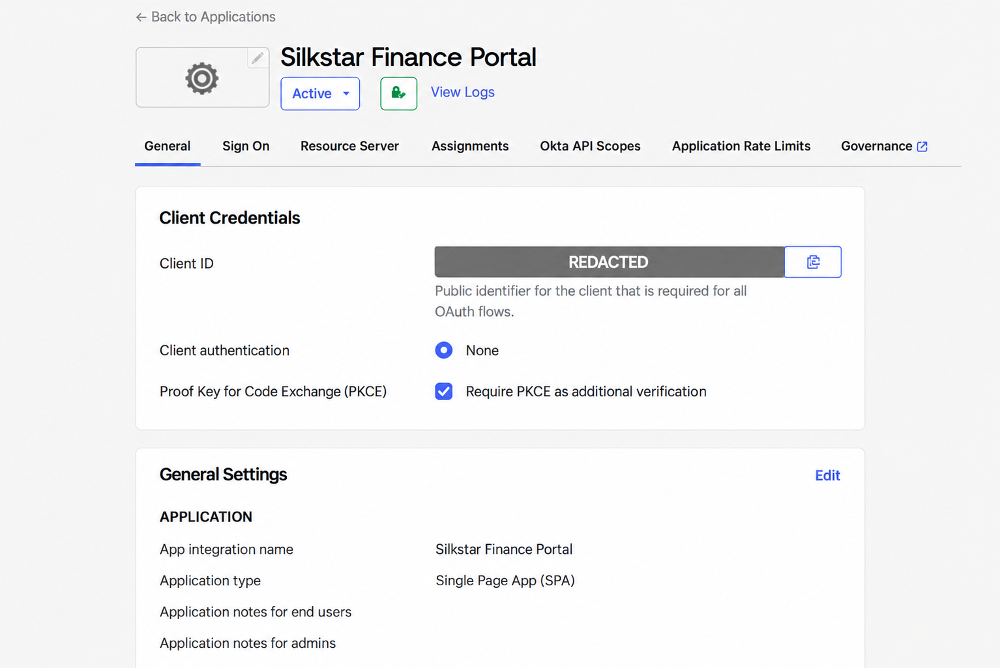
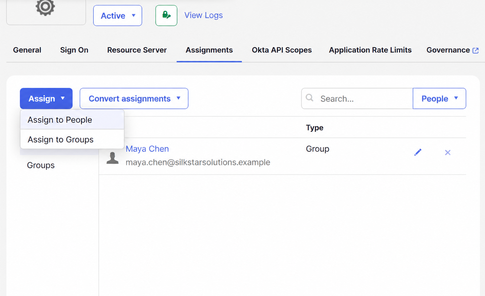
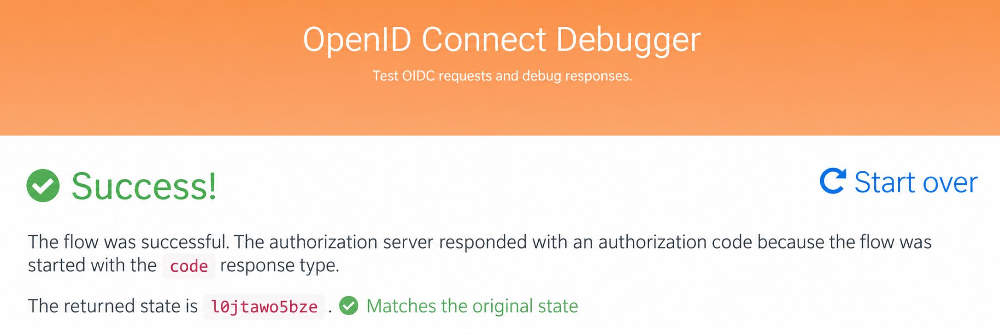
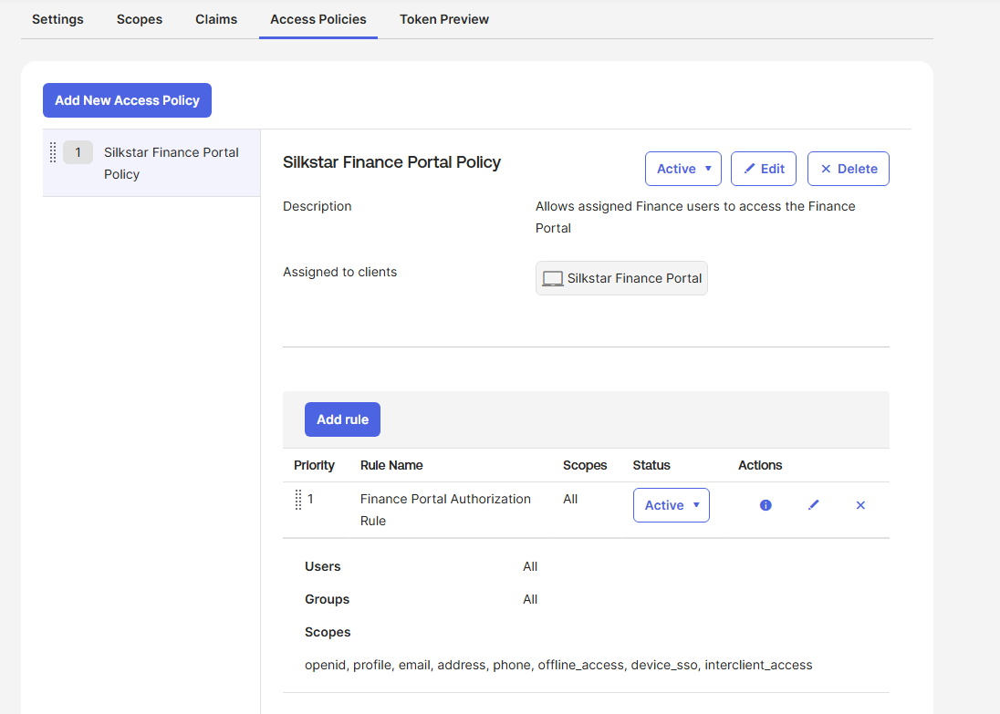

## Evidence

The following screenshots were sanitized to remove sensitive identifiers, authorization codes, and tokens.

### 1. Finance User and Group Configuration

A fictional employee identity was configured and associated with the `SS-Dept-Finance` group.

### 2. OIDC and PKCE Configuration

The Silkstar Finance Portal was configured as a single-page application with no client secret and required PKCE verification.

### 3. Group-Based Application Assignment

Maya inherited access to the application through a group assignment rather than an individual assignment.

### 4. Authorization Success

The OIDC Authorization Code flow completed successfully, and the returned state matched the original state.

### 5. Authorization-Server Access Policy

An active access policy and authorization rule were created for the Silkstar Finance Portal.

> Sensitive values—including tokens, authorization codes, client identifiers, tenant information, and credentials—were removed or excluded.
