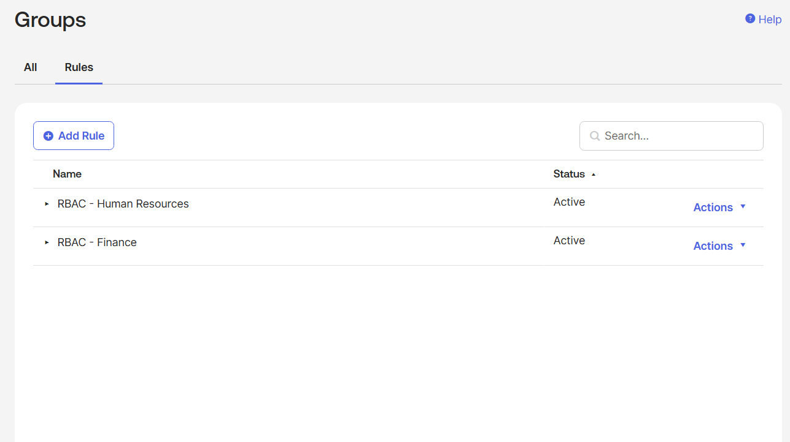
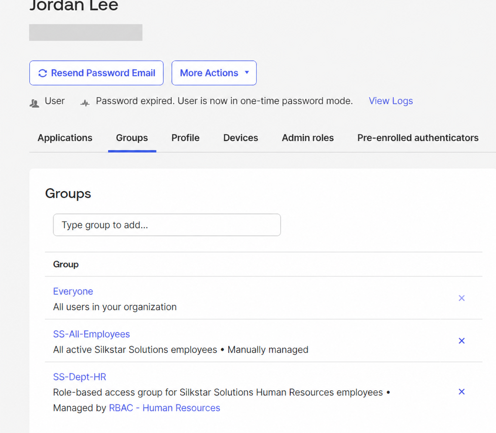
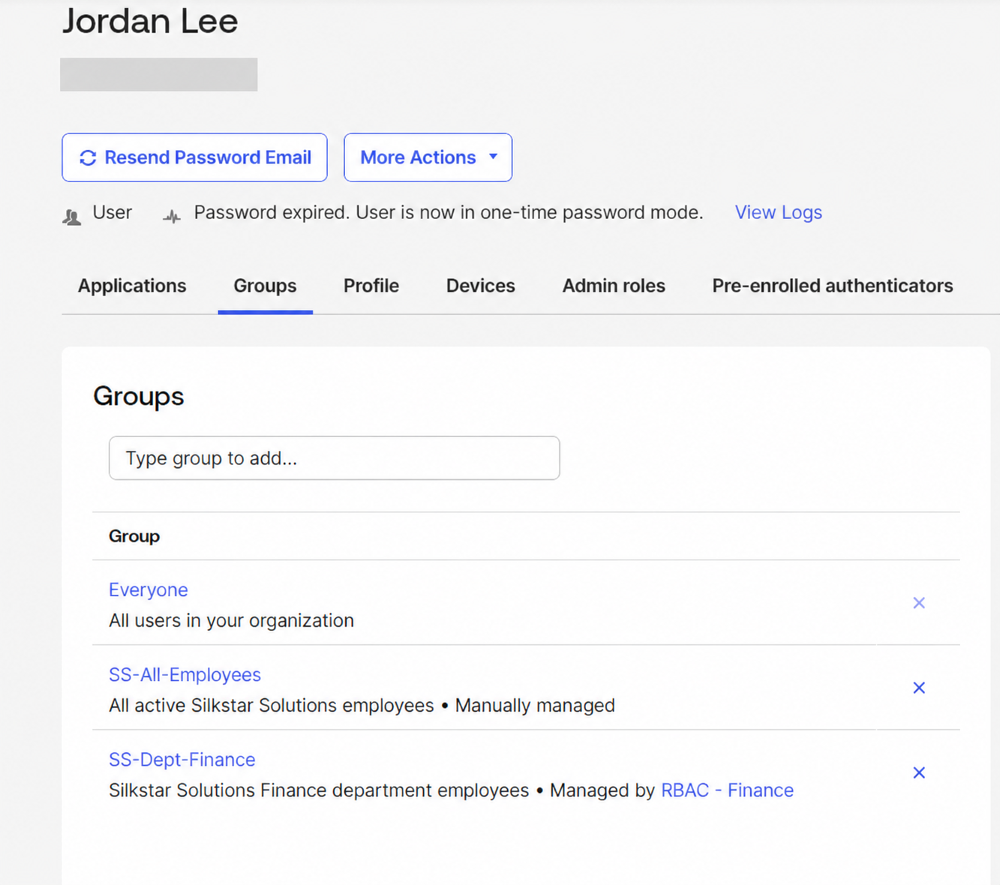
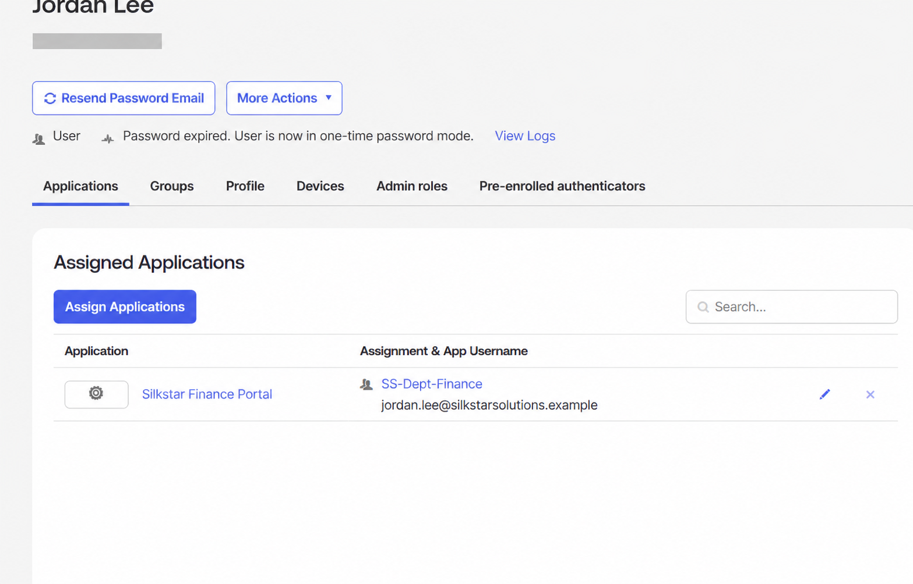
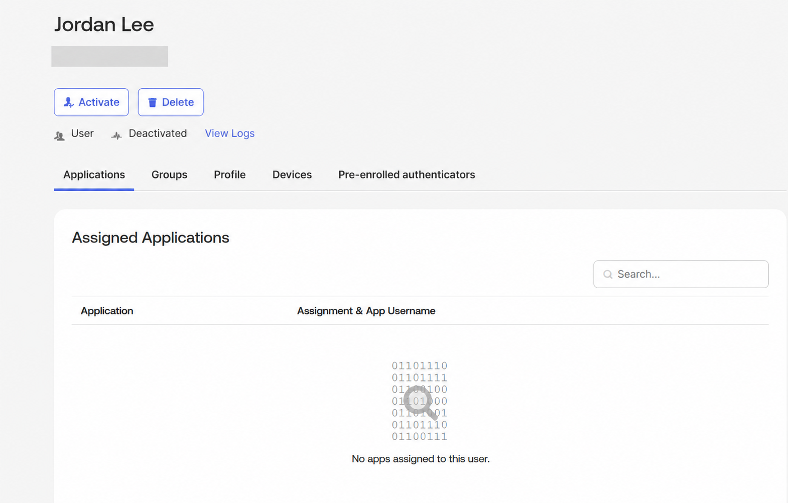
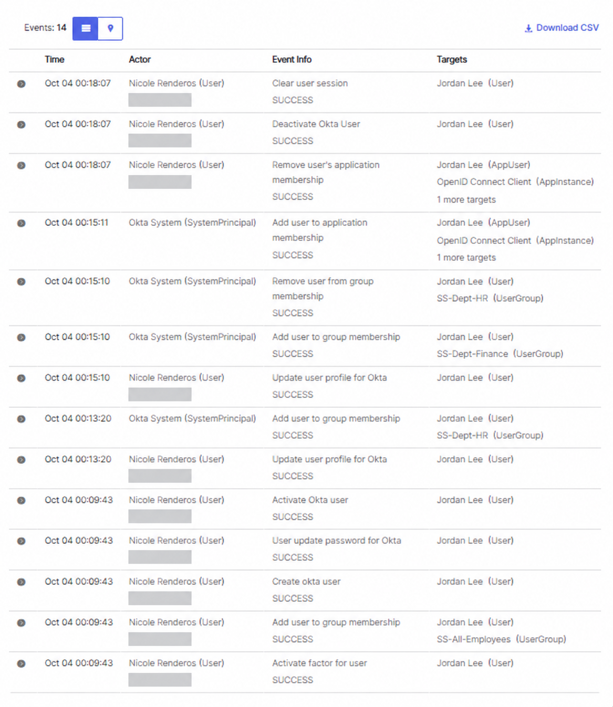

# Automated Joiner–Mover–Leaver Lifecycle and RBAC in Okta

## Project Overview

This project demonstrates an automated Joiner–Mover–Leaver (JML) identity lifecycle using Okta.

Silkstar Solutions needed department-based access that would automatically follow an employee through onboarding, an internal department transfer, and offboarding.

## What I Implemented

- Created Human Resources and Finance security groups in Okta.
- Built active group rules using the user's `department` profile attribute.
- Simulated a **joiner** by creating a fictional Human Resources employee.
- Verified that Okta automatically assigned the employee to `SS-Dept-HR`.
- Simulated a **mover** by changing the employee's department from Human Resources to Finance.
- Verified that Okta automatically removed the Human Resources group and assigned `SS-Dept-Finance`.
- Configured group-based access to automatically provision the Silkstar Finance Portal.
- Simulated a **leaver** by deactivating the employee's Okta account.
- Verified that Okta cleared the user's session and removed application access.
- Reviewed the Okta System Log to validate the complete lifecycle and create an audit trail.

## Security Concepts Demonstrated

- Joiner–Mover–Leaver identity lifecycle
- Role-Based Access Control (RBAC)
- Attribute-driven group rules
- Group-based application provisioning
- Automated access modification
- Automated deprovisioning
- Least privilege
- Session revocation
- Audit logging
- Identity lifecycle validation

## Evidence

### 1. Active Department-Based RBAC Rules

The Human Resources and Finance group rules are active and ready to assign users based on their department attribute.

### 2. Joiner Automatically Assigned to Human Resources

After the fictional employee was created with Human Resources as the department, Okta automatically assigned the user to the `SS-Dept-HR` group.

### 3. Mover Automatically Reassigned to Finance

After the department attribute was changed to Finance, Okta automatically removed the Human Resources group and assigned the user to `SS-Dept-Finance`.

### 4. Finance Portal Automatically Provisioned

Membership in `SS-Dept-Finance` automatically provisioned access to the Silkstar Finance Portal.

### 5. Leaver Deactivated and Access Removed

The employee's account was deactivated, the active session was cleared, and the assigned application was removed.

### 6. Complete JML Audit Trail

The Okta System Log shows the successful creation, group assignments, department change, application provisioning, group removal, session clearing, deactivation, and application-access removal events.

## Outcome

This lab demonstrates how identity attributes and role-based group rules can automate access throughout an employee's lifecycle.

The workflow reduced the need for manual access changes, supported least privilege, automatically removed access during offboarding, and created an auditable record of identity lifecycle events.
